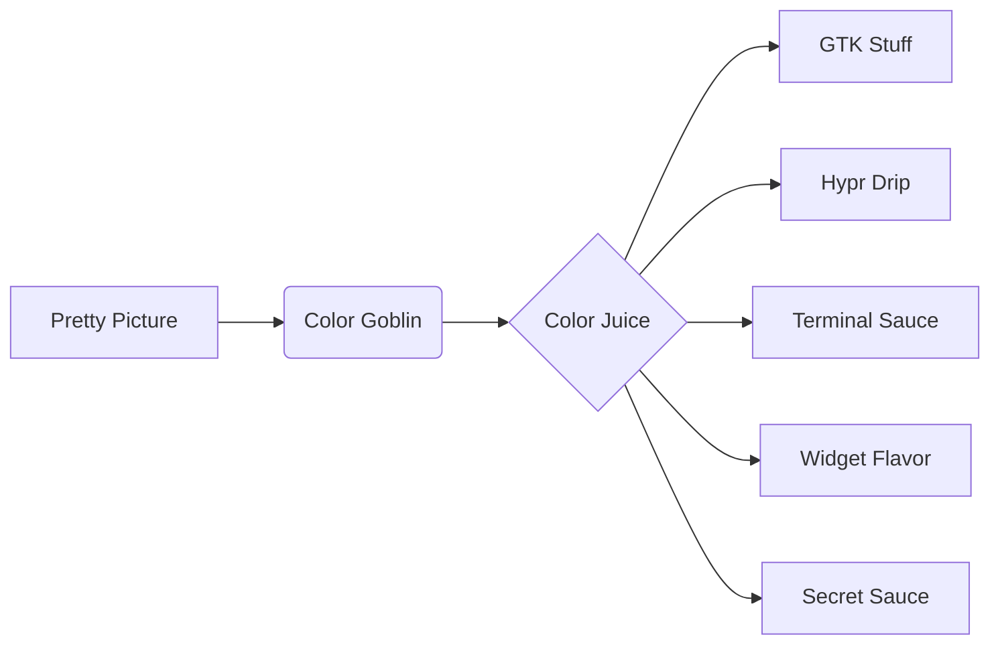

<div align="center">
  <h1 align="center">🌀 BnSplit's Dotfiles</h1>
  <p align="center">Hyprland Habitat Where Wallpapers Wage War on Blandness</p>


[](./screenshots)

</div>

---

## ✨ **Chromagic Engine**

My wallpaper becomes the puppet master of your eyeballs:

> "One wallpaper to rule them all,  
> One hue-picker to bind them,  
> And to the darkness bind them  
> (until you change wallpapers again)"
>
> - Not J.R.R. Tolkien

---

## 🛠 **Toolbox of Tomorrow**

| Weapon of Choice | Murder Function          |
| ---------------- | ------------------------ |
| `Hyprland`       | Your favorite compositor |
| `Neovim`         | LazyVim++ with coffee    |
| `Astal (AGS)`    | Widgets that widget      |
| `Waybar`         | Pretty system gossip     |
| `Kitty`          | Terminal go brrrrrr      |
| `ZSH`            | Prompt witchcraft        |

---

## 🎨 **Screenshot Circus**

<div align="center" style="column-count: 2; column-gap: 20px;">
  
  
  
  
</div>

---

## ⚡ **For the Impatient**

```bash
git clone --depth=1 https://github.com/BnSplits/Bn-Dotfiles.git
cd Bn-Dotfiles/Scripts
./setup.sh  # Say yes to everything like in the movies
```

---

## 🧠 **Color Mind Control Diagram**



---

## 📜 **License & Enlightenment**

[MIT Licensed](./LICENSE) - But hear this, padawan:

**🚨 Strong Recommendation**  
_This configuration exists purely as inspiration -  
you'll gain true Linux wizardry by:_

```bash
# Not cloning this directly
# ├── Writing your own configs
# └── Understanding each line
```

**Permitted But Not Advised:**

- Clone-and-forget approach ❌
- Blind copy/paste without reading 🦇
- Using as final rather than template 📋

**Credits Where Due:**

- Dynamic theming core: My own madness (`Somewhere/col_gen`)
- AGS Widget Magic: [Astal](https://aylur.github.io/astal/)
- Neovim Foundation: [LazyVim](https://github.com/LazyVim/LazyVim)

**Wisdom Path:**

1. Fork this repo ⚔️
2. Read the code 🧐
3. Delete 90% ✂️
4. Build your own castle 🏰

_"The real dotfiles are the friends you make along the config journey."_
