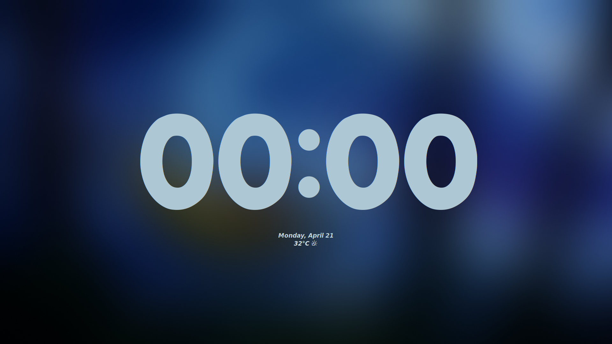
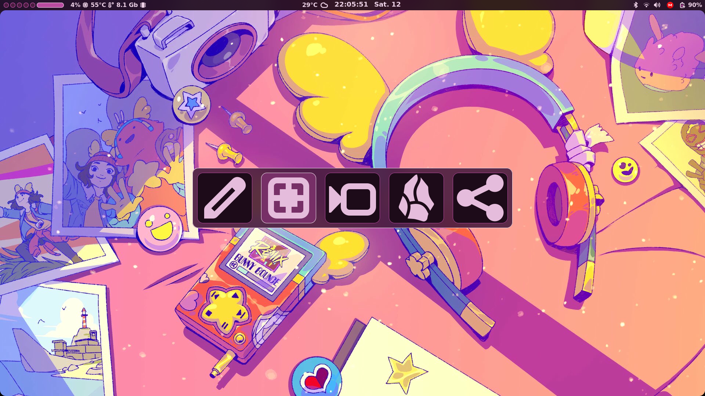
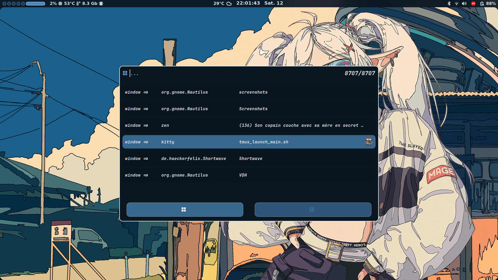
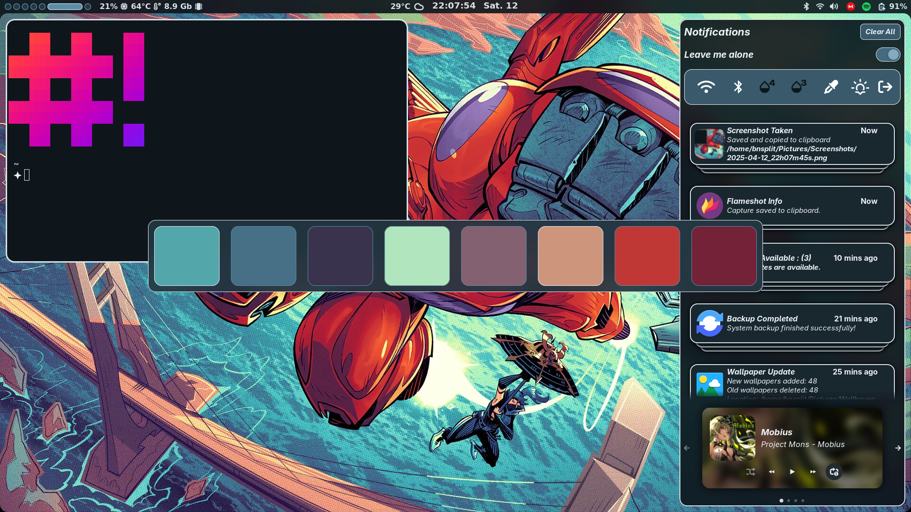
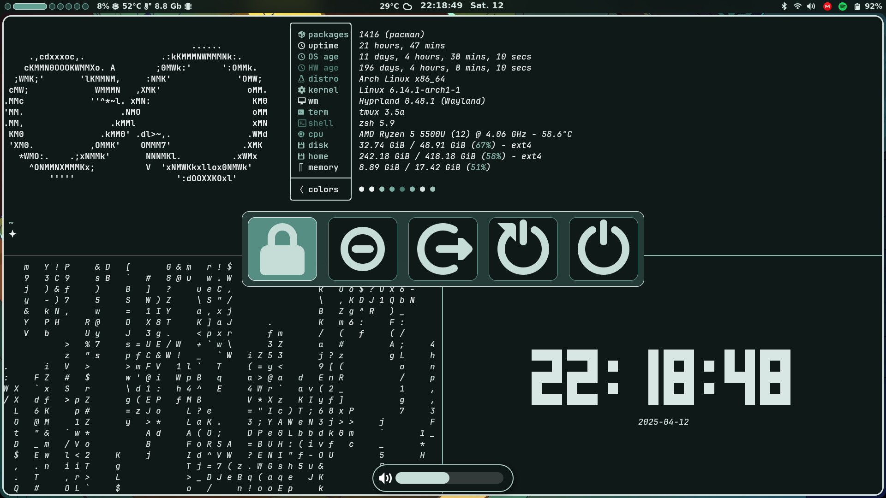

<div align="center">
  <h1>🌀 BnSplit's Dotfiles</h1>
  <p>Hyprland Setup with Dynamic Theming</p>
  <a href="./screenshots"></a>
</div>

---

## 🖼 **Screenshots**

<div align="center" style="column-count: 2; column-gap: 20px;">
  
  
  
  
</div>

---

## ⚡ **Quick Install**

```bash
git clone --depth=1 https://github.com/BnSplits/Dotfiles.git
cd Dotfiles/
./setup_arch.sh
```

---

## 🔗 **Credits**
- Theming Tools (own made): Chromapick (color extraction) + Chromafade (gradients)
- Widget System: Astal
- Neovim Base: LazyVim
